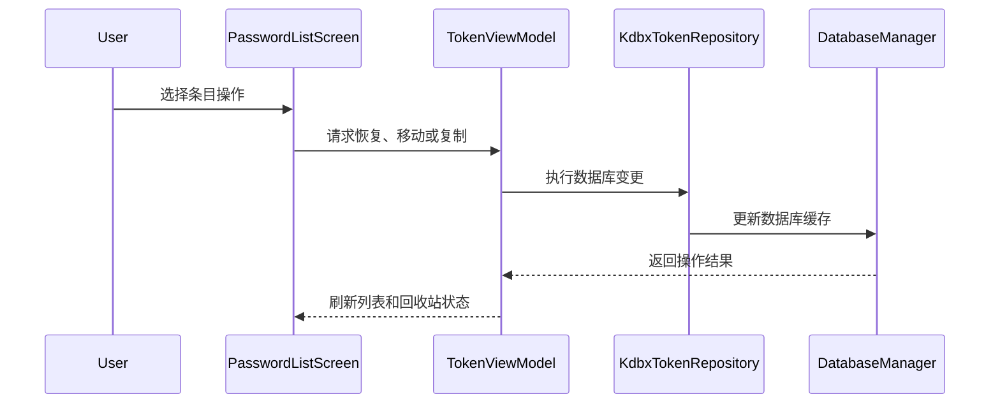

# PR #5：Agent 功能迁移实现 — 评审报告

## 一、PR 元信息

| 项目 | 值 |
|------|-----|
| PR 编号 | [#5](https://github.com/WebDAVPass/Android/pull/5) |
| 标题 | Agent 功能迁移实现 |
| 作者 | xzy-nine |
| 状态 | OPEN |
| 创建时间 | 2026-08-10T12:04:49Z |
| 合并时间 | — |
| 分支 | dev-keepass → agent-功能迁移实现 |
| 提交数 | 27 |
| 变更统计 | +4637 −136，共 33 个文件 |

## 二、评审概览

| 项目 | 值 |
|------|-----|
| 评审工具 | CodeRabbit |
| 评审配置 | CHILL / Pro Plus |
| 内嵌评论（严重/极其严重） | 16 条 |
| 超出 diff 范围评论 | 5 条 |
| Minor 评论 | 10 条 |
| Nitpick 评论 | 15 条 |
| 评审提交范围 | 1bfa837 → 960cf9a |

## 三、内嵌评论（严重 / 极其严重级别，优先展示）

> 共 16 条，全部由 CodeRabbit 提出，均属于 🟠 Major（严重）或 🔴 Critical（极其严重）级别。

| # | 级别 | 分类 | 位置 | 评论内容 |
|---|------|------|------|----------|
| 1 | 严重 | 🔒 Security & Privacy | `AutofillPickerActivity.kt:287` | **表单密码默认以明文展示，请默认遮蔽。**   该界面无条件显示待保存的密码明文。`FLAG_SECURE` 只能阻止截屏与录屏，无法防止旁观者读取。请默认使用掩码，并提供显示切换。  **[🔒 建议修改]**  <pre><code>+        var showFormPassword by remember { mutableStateOf(false) }          Text( -            text = "密码：${registerInfo.password.orEmpty()}", +            text = "密码：" + if (showFormPassword) { +                registerInfo.password.orEmpty() +            } else { +                "•".repeat(registerInfo.password?.length ?: 0) +            },              fontSize = 14.sp,              color = MiuixTheme.colorScheme.onSurface          ) +        TextButton( +            text = if (showFormPassword) "隐藏密码" else "显示密码", +            onClick = { showFormPassword = !showFormPassword } +        ) </code></pre>  `showFormPassword` 需要与其他状态一起声明在 Composable 顶部。  **[📝 Committable suggestion]**  > ‼️ **IMPORTANT** > Carefully review the code before committing. Ensure that it accurately replaces the highlighted code, contains no missing lines, and has no issues with indentation. Thoroughly test & benchmark the code to ensure it meets the requirements.  <pre><code>        var showFormPassword by remember { mutableStateOf(false) }         Text(             text = "密码：" + if (showFormPassword) {                 registerInfo.password.orEmpty()             } else {                 "•".repeat(registerInfo.password?.length ?: 0)             },             fontSize = 14.sp,             color = MiuixTheme.colorScheme.onSurface         )         TextButton(             text = if (showFormPassword) "隐藏密码" else "显示密码",             onClick = { showFormPassword = !showFormPassword }         ) </code></pre>   |
| 2 | 严重 | 🩺 Stability & Availability | `AutofillSavePreferences.kt:49` | **自动填充“提示保存”偏好的加载路径存在同一处根因：同步阻塞读取 + 一次性缓存。** `AutofillSavePreferences.load` 用 `runBlocking` 在服务主线程等待 Room 完成读取，`KeeAutofillService` 随后把结果复制到本地字段。改为异步加载后，本地复制会读到未完成加载的默认值；不改为异步则主线程被阻塞。两处需要一起修改。  - `app/src/main/java/xzynine/WebDAVPass/Android/autofill/AutofillSavePreferences.kt#L24-L49`：把 `load` 与 `setAskToSaveData` 中的 `runBlocking` 替换为在 `Dispatchers.IO` 上启动的协程，`askToSaveData` 保持 `@Volatile` 即时写入。 - `app/src/main/java/xzynine/WebDAVPass/Android/autofill/KeeAutofillService.kt#L63-L66`：删除本地字段 `askToSaveData`，在 Line 154 与 Line 190 的使用点直接读取 `AutofillSavePreferences.askToSaveData`。  **[📍 Affects 2 files]**  - `app/src/main/java/xzynine/WebDAVPass/Android/autofill/AutofillSavePreferences.kt#L24-L49` (this comment) - `app/src/main/java/xzynine/WebDAVPass/Android/autofill/KeeAutofillService.kt#L63-L66`   |
| 3 | 严重 | 🗄️ Data Integrity & Integration | `KdbxTokenRepository.kt:356` | **恢复条目历史前先复制当前状态，再使用目标历史版本覆盖当前内容。**   `EntryInfo` 没有 history 字段，第 352-353 行的 `getEntryInfo`/`setEntryInfo` 不会带进旧条目历史；同时 `addEntryToHistory` 直接把 `historyToRestore` 本身加入历史列表，恢复后会把同一历史版本追加两次。应改为：先 `entry.addEntryToHistory(historyToRestore)` 保存当前版本，再根据目标版本的内容写入当前条目。 |
| 4 | 严重 | 🗄️ Data Integrity & Integration | `KdbxTokenRepository.kt:829` | **先写完完整文件再覆盖目标，避免写入失败丢失数据库。**   `saveDatabase` 会将新数据库写到临时缓存文件，然后把该缓存内容写入 `openOutputStream(location)`。`openOutputStream` 对 `FileLocation` 使用 `File.outputStream()`，对 `UriLocation` 使用 `contentResolver.openOutputStream(location.uri, "wt")`；这两种方式都会先截断目标文件。如果 `Database.saveData(...).write(buffer)` 中途失败，调用方又捕获 `IOException`，磁盘上的数据库就被截断或覆盖成不完整内容；`DatabaseManager.close()` 无法恢复旧数据，注释中的“磁盘文件未被改写”不成立。  改为先完成到临时文件，成功后再原子替换目标；或使用只追加/重命名的写入策略保留原数据。 |
| 5 | 严重 | 🔒 Security & Privacy | `KdbxTokenRepository.kt:896` | **导出的临时文件没有被删除，会在缓存目录持续累积数据库副本。**   第 880 行在 `cacheDirectory` 中创建 `kdbx-export-*.tmp`，但 `finally` 块只处理数据库实例，不删除该文件。每次导出都会留下一份数据库内容的副本。这既是磁盘泄漏，也是敏感数据残留。  对比 `createDatabaseBytes`（第 119 行）已经做了 `runCatching { cacheFile.delete() }`。  **[🔒 建议的修复]**  <pre><code>+            val cacheFile = File.createTempFile("kdbx-export-", ".tmp", cacheDirectory)              try { -                val cacheFile = File.createTempFile("kdbx-export-", ".tmp", cacheDirectory)                  database.saveData(                      cacheFile = cacheFile,                      databaseOutputStream = outputStreamProvider,                      isNewLocation = true,                      masterCredential = MasterCredential(                          password = masterPassword,                          keyFileData = DatabaseManager.getKeyFileData()                      ),                      challengeResponseRetriever = emptyChallengeResponseRetriever                  )                  true              } finally { +                runCatching { cacheFile.delete() }                  if (cachedPair == null) {                      database.clearAndClose(cacheDirectory)                  }              } </code></pre>  `saveDatabase`（第 1675 行）存在同样的临时文件残留，建议一并处理。  **[📝 Committable suggestion]**  > ‼️ **IMPORTANT** > Carefully review the code before committing. Ensure that it accurately replaces the highlighted code, contains no missing lines, and has no issues with indentation. Thoroughly test & benchmark the code to ensure it meets the requirements.  <pre><code>            val cacheFile = File.createTempFile("kdbx-export-", ".tmp", cacheDirectory)             try {                 database.saveData(                     cacheFile = cacheFile,                     databaseOutputStream = outputStreamProvider,                     isNewLocation = true,                     masterCredential = MasterCredential(                         password = masterPassword,                         keyFileData = DatabaseManager.getKeyFileData()                     ),                     challengeResponseRetriever = emptyChallengeResponseRetriever                 )                 true             } finally {                 runCatching { cacheFile.delete() }                 if (cachedPair == null) {                     database.clearAndClose(cacheDirectory)                 }             } </code></pre>   |
| 6 | 严重 | 🗄️ Data Integrity & Integration | `KdbxTokenRepository.kt:935` | **合并失败时没有丢弃缓存实例，部分合并的状态可能被写回磁盘。**   `db.mergeData` 在中途抛出异常时（例如合并文件密码错误、文件损坏），内存中的 `db` 可能已经写入了部分节点。当前实现只在外层 `runCatching` 里记录日志并返回 `false`，`DatabaseManager` 中的缓存实例继续保留这个被污染的状态。此后任何写操作都会把部分合并的数据保存到磁盘。  `changeDatabaseSettings`（第 817-821 行）对同类风险采用了「失败即 `DatabaseManager.close()`」的处理。建议在此处保持一致。  **[🐛 建议的修复]**  <pre><code>         }.onFailure { +            // 合并可能已部分改动内存实例，丢弃缓存以免污染状态被写回磁盘 +            DatabaseManager.close()              Logger.e(LOG_TAG, "mergeLocalDatabaseFile failed, path=$localPath, message=${it.message}", it)          }.getOrDefault(false) </code></pre>  `mergeRemoteDatabaseBytes`（第 1108-1110 行）存在同样的问题，建议一并处理。  **[📝 Committable suggestion]**  > ‼️ **IMPORTANT** > Carefully review the code before committing. Ensure that it accurately replaces the highlighted code, contains no missing lines, and has no issues with indentation. Thoroughly test & benchmark the code to ensure it meets the requirements.  <pre><code>        return runCatching {             withDatabase(localPath, masterPassword, saveAfter = true) { db -&gt;                 val mergeLocation = resolveLocation(mergeFileUri)                 openInputStream(mergeLocation).use { input -&gt;                     db.mergeData(                         databaseToMergeStream = input,                         // 合并文件的凭据仅使用其主密码（界面只收集密码）；                         // 使用密钥文件保护的库暂不支持合并                         databaseToMergeMasterCredential = MasterCredential(                             password = mergeMasterPassword                         ),                         databaseToMergeChallengeResponseRetriever = emptyChallengeResponseRetriever,                         isRAMSufficient = { true },                         progressTaskUpdater = null                     )                 }                 true             }         }.onFailure {             // 合并可能已部分改动内存实例，丢弃缓存以免污染状态被写回磁盘             DatabaseManager.close()             Logger.e(LOG_TAG, "mergeLocalDatabaseFile failed, path=$localPath, message=${it.message}", it)         }.getOrDefault(false) </code></pre>   |
| 7 | 严重 | 🔒 Security & Privacy | `MainActivity.kt:142` | **锁定后部分路由不会跳转到解锁页。**   `lockCurrentLibrary()` 只重置解锁状态，不改变导航栈。`Route.SecurityCheck`、`Route.TokenList`、`Route.PasswordList`、`Route.PasswordEntryDetail` 都有 `LaunchedEffect(isLibraryUnlocked, lib)` 守卫并跳回 `Route.Welcome`。`Route.Home`、`Route.Settings` 和新增的 `Route.DatabaseSettings` 没有该守卫。  如果超时锁定或后台锁定在这三个页面触发，界面仍停留在原页面，用户无需重新输入主密码即可继续浏览已渲染的内容。请为这三个路由补充相同的解锁守卫，或在 `MainScreen` 层集中处理锁定后的导航。  Also applies to: 309-319 |
| 8 | 严重 | 🎯 Functional Correctness | `DatabaseSettingsScreen.kt:193` | **统一未知 KDF 时的界面与保存输入。**   数据库为 `kdfOptions` 之外的 KDF 时，`kdfSelectedIndex` 为 `-1`：`WindowSpinnerPreference` 当前显示第一个选项，界面仍显示 Argon2 输入框，保存时虽然 KDF 为 `null` 但会传递用户输入的 `keyRounds` / `memoryUsageMb` / `parallelism`。  按选中索引决定参数输入框：未选中时隐藏全部 KDF 参数；选中 AES 时仅显示轮数；选中 Argon2 时显示 Argon2 参数，并在保存前校验。 |
| 9 | 极其严重 | 🎯 Functional Correctness | `EntryEditorComposables.kt:46` | **同步更新 `PasswordListScreen.kt` 的调用契约。**   这两个 Composable 现在要求状态回调。`PasswordListScreen.kt` 的 `CustomFieldsEditor(fields = customFields)` 和 `ExpiryTimeEditor(value = expiryTime)` 没有传入必需参数。Kotlin 编译会因缺少 `onFieldsChange` 和 `onValueChange` 失败。  **[建议修改]**  <pre><code>- CustomFieldsEditor(fields = customFields) - ExpiryTimeEditor(value = expiryTime) + CustomFieldsEditor( +     fields = customFields, +     onFieldsChange = { customFields = it } + ) + ExpiryTimeEditor( +     value = expiryTime, +     onValueChange = { expiryTime = it } + ) </code></pre>  Also applies to: 134-137 |
| 10 | 严重 | 🩺 Stability & Availability | `HomeScreen.kt:92` | **移除 `LaunchedEffect` 内的 `coroutineScope.launch`。**   `LaunchedEffect` 已经提供随 key 变化取消的协程。当前实现把扫描放进 `rememberCoroutineScope()` 的子协程，该子协程不会在 key 变化时取消。计数快速连续变化时，先启动的扫描可能后完成并覆盖较新的结果，导致 `securityIssueCount` 显示过期数字。请直接在 `LaunchedEffect` 体内调用挂起函数。  **[🐛 建议修复]**  <pre><code>     LaunchedEffect(passwordTotalCount, recentDeletedCount) { -        coroutineScope.launch { -            val issues = tokenViewModel.loadSecurityIssues() -            // 以不重复的问题条目计数（同一条目同时过期且弱密码只计一次） -            securityIssueCount.intValue = (issues.expiredEntries.map { it.entryId } + -                issues.weakPasswordEntries.map { it.entryId }).distinct().size -        } +        val issues = tokenViewModel.loadSecurityIssues() +        // 以不重复的问题条目计数（同一条目同时过期且弱密码只计一次） +        securityIssueCount.intValue = (issues.expiredEntries.map { it.entryId } + +            issues.weakPasswordEntries.map { it.entryId }).distinct().size      } </code></pre>  移除后，`rememberCoroutineScope()`（第 82 行）与 `kotlinx.coroutines.launch` 导入若无其他用途也应一并删除。  **[📝 Committable suggestion]**  > ‼️ **IMPORTANT** > Carefully review the code before committing. Ensure that it accurately replaces the highlighted code, contains no missing lines, and has no issues with indentation. Thoroughly test & benchmark the code to ensure it meets the requirements.  <pre><code>    LaunchedEffect(passwordTotalCount, recentDeletedCount) {         val issues = tokenViewModel.loadSecurityIssues()         // 以不重复的问题条目计数（同一条目同时过期且弱密码只计一次）         securityIssueCount.intValue = (issues.expiredEntries.map { it.entryId } +             issues.weakPasswordEntries.map { it.entryId }).distinct().size     } </code></pre>   |
| 11 | 严重 | 🔒 Security & Privacy | `PasswordEntryDetailScreen.kt:1122` | **默认隐藏受保护字段的值。**   `item.isProtected` 只改变标签和图标，但 Line 1105 仍直接渲染 `item.rawValue`。打开详情页会立即显示受保护字段的内容。  对受保护字段使用掩码。仅在用户明确执行显示操作后渲染原始值。复制按钮可以继续复制原始值。  **[建议修改]**  <pre><code>-                text = item.rawValue, +                text = if (item.isProtected) "••••••" else item.rawValue, </code></pre>  **[📝 Committable suggestion]**  > ‼️ **IMPORTANT** > Carefully review the code before committing. Ensure that it accurately replaces the highlighted code, contains no missing lines, and has no issues with indentation. Thoroughly test & benchmark the code to ensure it meets the requirements.  <pre><code>            val displayName = displayFieldName(item.fieldName)             Text(                 text = if (item.isProtected) "$displayName（已保护）" else displayName,                 fontSize = 14.sp,                 fontWeight = FontWeight.Medium,                 color = MiuixTheme.colorScheme.onSurface             )             Text(                 text = if (item.isProtected) "••••••" else item.rawValue,                 fontSize = 13.sp,                 color = MiuixTheme.colorScheme.onSurfaceSecondary             )         }         if (item.isProtected) {             Icon(                 imageVector = MiuixIcons.Lock,                 contentDescription = "受保护字段",                 tint = MiuixTheme.colorScheme.onSurfaceSecondary,                 modifier = Modifier.padding(end = 8.dp)             )         }         IconButton(onClick = onCopy) {             Icon(                 imageVector = MiuixIcons.Copy,                 contentDescription = "复制 ${item.fieldName}"             ) </code></pre>   |
| 12 | 严重 | 🎯 Functional Correctness | `WelcomeScreen.kt:878` | **只有「主密码解锁」按钮传递了密钥文件，其他解锁路径仍未携带。**   这里正确地把 `inlineKeyFileData` 传给了 `unlockCurrentLibrary`。但同一屏幕上的凭据/生物识别解锁路径没有做同样处理：  - 第 434-437 行 `verifyCurrentLibraryPassword(masterPassword = plainPassword, updateManualTimestamp = true)` 不传 `inlineKeyFileData`。 - 第 473-476 行 `unlockCurrentLibrary(plainPassword, isManualUnlock = true)` 不传 `inlineKeyFileData`。 - 第 214-217 行 `reactivate` 流程的 `unlockCurrentLibrary` 同样不传。  如果数据库由密钥文件保护，用户在这些路径下即使输入了正确的主密码并选好了密钥文件，校验也会失败，界面会显示「解锁失败：主密码不正确或文件无效」，误导用户以为密码错误。 |
| 13 | 严重 | 🔒 Security & Privacy | `LibraryViewModel.kt:121` | **使用密钥文件解锁时关闭缓存不擦除密钥字节。**   `DatabaseManager.close()` 在 `lockCurrentLibrary()` 路径会清空缓存并置 `keyFileData = null`，但只会丢弃已登记的密钥文件 `ByteArray` 的引用；之前的解密凭据仍留在 JVM 堆中直到 GC。`resetUnlockState()` 还需要在设为 `null` 前以安全方式置零该数组。 |
| 14 | 严重 | 🎯 Functional Correctness | `PasswordPagingSubViewModel.kt:121` | **排序、大小写与过期过滤设置在分组导航和写入刷新后会被静默重置。**   新增的 `caseSensitive`、`sortMode`、`ascending`、`hideExpired` 只作为方法参数传入，不保存在 `PasswordPagingSubViewModel` 的状态中。以下调用点都只传 `searchQuery`，其余参数回落到默认值：  - 第 267 行 `openPasswordGroup` - 第 280 行 `navigateUpPasswordGroup` - 第 288 行与第 294 行 `resetPasswordGroupNavigation` - `PasswordViewModel.setPasswordListMode`（第 110 行） - `TokenViewModel.onPasswordWriteSuccess`（第 734 行，无参调用）  因此用户设置排序方式后，只要进入子分组、返回上级、或保存任一条目，列表就会跳回默认排序，并重新显示已隐藏的过期条目。  建议把这些配置提升为该 ViewModel 的持有状态，`refreshPasswordEntries` 在未显式传参时复用当前值。 |
| 15 | 严重 | 🎯 Functional Correctness | `PasswordPagingSubViewModel.kt:374` | **文件夹排序方向与注释相反，文件夹会被排到列表末尾。**   第 373 行 `compareBy<PasswordEntry> { it.isFolderPlaceholder }` 使用 `Boolean` 的自然顺序，即 `false < true`。因此 `isFolderPlaceholder == false` 的普通条目排在前面，文件夹排在后面。这与第 362 行注释「文件夹始终置前」相反。  `KdbxTokenRepository.buildPasswordEntries`（第 1445 行）使用 `compareBy { if (it.isFolderGroup) 0 else 1 }`，文件夹在前。两处排序行为不一致。  **[🐛 建议的修复]**  <pre><code>         val keyComp = if (ascending) byKey else byKey.reversed() -        return compareBy&lt;PasswordEntry&gt; { it.isFolderPlaceholder }.then(keyComp) +        return compareBy&lt;PasswordEntry&gt; { if (it.isFolderPlaceholder) 0 else 1 }.then(keyComp)      } </code></pre>  **[📝 Committable suggestion]**  > ‼️ **IMPORTANT** > Carefully review the code before committing. Ensure that it accurately replaces the highlighted code, contains no missing lines, and has no issues with indentation. Thoroughly test & benchmark the code to ensure it meets the requirements.  <pre><code>    private fun passwordEntryComparator(sortMode: PasswordSortMode, ascending: Boolean): Comparator&lt;PasswordEntry&gt; {         val byKey: Comparator&lt;PasswordEntry&gt; = when (sortMode) {             PasswordSortMode.DEFAULT -&gt; compareBy { it.title.ifBlank { it.account }.lowercase() }             PasswordSortMode.TITLE -&gt; compareBy { it.title.lowercase() }             PasswordSortMode.ACCOUNT -&gt; compareBy { it.account.lowercase() }             PasswordSortMode.MODIFIED_TIME -&gt; compareBy { it.modifiedTime }             PasswordSortMode.CREATED_TIME -&gt; compareBy { it.creationTime }         }         val keyComp = if (ascending) byKey else byKey.reversed()         return compareBy&lt;PasswordEntry&gt; { if (it.isFolderPlaceholder) 0 else 1 }.then(keyComp)     } </code></pre>   |
| 16 | 严重 | 🔒 Security & Privacy | `TokenViewModel.kt.kt:667` | **修改主密码或密钥文件后，应失效自动解锁凭据。**   `changeDatabaseSettings` 只在成功后更新内存主密码和密钥文件；`AutoUnlockViewModel.unlockWithBiometric` 只解密已保存的主密码，不支持传入新密码或新密钥文件。修改数据库后，已启用的生物识别仍会用旧主密码加密内容解锁，后续失败。在返回成功前，如果 `autoUnlockEnabled` 为 true，调用 `autoUnlockViewModel.invalidateAutoUnlock(...)` 清理旧自动解锁凭据。 |

## 四、其他评论（整合为单一折叠评论）

📎 其他评论（共 30 条：超出 diff 范围 5 条 + Minor 10 条 + Nitpick 15 条）

> 以下评论因平台限制无法内联或属于较低严重级别，按 CodeRabbit 原报告分区整合于此。

### ⚠️ 超出 diff 范围评论（5 条，平台限制无法内联）

| # | 级别 | 分类 | 位置 | 评论内容 |
|---|------|------|------|----------|
| 1 | 严重 | 🚀 Performance & Scalability | `PasswordListScreen.kt `271-304`` | **两个 `LaunchedEffect` 会在首次组合时重复触发刷新。** 第一个效果在首次进入时会跳过刷新（注释 Line 292 说明 `reloadInitialPasswordData` 已完成加载）。第二个效果没有同样的守卫，首次组合时会无条件调用一次 `refreshPasswordEntries`，抵消了第一个效果的优化，并可能重置分页与滚动位置。  建议合并为一个 `LaunchedEffect`，并统一使用 `isSearchEverEnabled` 之外的“首次组合”守卫。  **[♻️ 建议修改]**  <pre><code>-    LaunchedEffect(searchQuery) { -        if (searchQuery.isNotBlank()) { -            isSearchEverEnabled.value = true -            tokenViewModel.passwordViewModel.refreshPasswordEntries(...) -        } else if (isSearchEverEnabled.value) { -            tokenViewModel.passwordViewModel.refreshPasswordEntries(...) -        } -    } - -    LaunchedEffect(searchCaseSensitive, sortModeOrdinal, sortAscending, hideExpired) { -        tokenViewModel.passwordViewModel.refreshPasswordEntries(...) -    } +    val isFirstComposition = remember { mutableStateOf(true) } +    LaunchedEffect(searchQuery, searchCaseSensitive, sortModeOrdinal, sortAscending, hideExpired) { +        if (searchQuery.isNotBlank()) { +            isSearchEverEnabled.value = true +        } +        // 首次进入且未搜索、未改动排序过滤：reloadInitialPasswordData 已完成加载 +        if (isFirstComposition.value &amp;&amp; searchQuery.isBlank()) { +            isFirstComposition.value = false +            return@LaunchedEffect +        } +        isFirstComposition.value = false +        tokenViewModel.passwordViewModel.refreshPasswordEntries( +            searchQuery = searchQuery, +            caseSensitive = searchCaseSensitive, +            sortMode = sortMode, +            ascending = sortAscending, +            hideExpired = hideExpired +        ) +    } </code></pre>   |
| 2 | 严重 | 🗄️ Data Integrity & Integration | `CloudLibraryDialog.kt `234-251`` | **在云端库创建流程中持久化密钥文件引用。** `createRemote` 仅将 `keyFileData` 传入 `createEmptyKdbxBytes`，返回的 `LibraryContext` 和对应的 `LibraryContextEntity` 都没有密钥文件字段或加密保存逻辑；`welcomeScreen` 创建回调只在本地新建时进入 `localCreateLauncher`，云端新建没有上传/保存密钥文件。下次打开纯密码解锁会失败。需要为云端库保存密钥文件路径、URI 或安全方式的内容，并在该库解锁时透传给 `libraryViewModel.unlockCurrentLibrary`。   |
| 3 | 严重 | 🎯 Functional Correctness | `WelcomeScreen.kt `1104-1121`` | **取消创建对话框时没有清除 `pendingCreateKeyFileData`，遗留值会用于下一次新建。** 第 1107-1110 行的 `onDismiss` 只重置 `pendingCreateMasterPassword`，不重置 `pendingCreateKeyFileData`。第 311-315 行的 `BackHandler` 分支存在同样的遗漏。  复现路径：  1. 用户点「本地新建」，在对话框中选择了密钥文件，然后取消。 2. `pendingCreateKeyFileData` 保留该字节数组。 3. 用户再次点「本地新建」，这次不选择密钥文件，直接确认。 4. `CreateMasterPasswordDialog` 回调传回 `keyFileData = null`，但第 1113 行会把 `pendingCreateKeyFileData` 覆盖为 `null` —— 这一步是安全的。  真正的风险在于路径 1-2 之后用户不再打开对话框，而是通过其他入口触发 `localCreateLauncher` 或 `showCloudCreateDialog`：此时第 666 行和第 1089 行仍会读到遗留的密钥文件字节，新库会被该密钥文件加密，用户无从知晓，之后仅凭主密码无法解锁。  建议在两个取消路径中一并清除。  **[🐛 建议的修复]**  <pre><code>             onDismiss = {                  showCreateMasterPasswordDialog = false                  pendingCreateMasterPassword = "" +                pendingCreateKeyFileData = null              }, </code></pre>  同时在第 311-315 行的 `BackHandler` 分支中：  <pre><code>         if (showCreateMasterPasswordDialog) {              showCreateMasterPasswordDialog = false              pendingCreateMasterPassword = "" +            pendingCreateKeyFileData = null              return@BackHandler          } </code></pre>   |
| 4 | 极其严重 | 🗄️ Data Integrity & Integration | `KdbxTokenRepository.kt `124-142`` | **密钥文件凭据在解锁链路上没有贯通。** 本次 PR 让创建、验证和保存都支持 `keyFileData`，但凭据在「解锁成功 → 登记 → 后续复用」这条链上存在断点：仓库层解锁后从不写入 `DatabaseManager`，UI 层只有一条解锁路径传递密钥文件，改密后自动解锁凭据也不更新。任何一处不修，密钥文件保护的数据库都无法正常使用。 - `app/src/main/java/xzynine/WebDAVPass/Android/data/KdbxTokenRepository.kt#L124-L142`：在 `DatabaseManager.store(...)` 之后调用 `DatabaseManager.setKeyFileData(effectiveKeyFileData)`，使 `saveDatabase`、`mergeRemoteDatabaseBytes`、`exportDatabaseTo` 的默认凭据能取到正确的密钥文件。 - `app/src/main/java/xzynine/WebDAVPass/Android/ui/Screen/WelcomeScreen.kt#L875-L878`：把 `inlineKeyFileData` 同样传给第 434-437 行的 `verifyCurrentLibraryPassword`、第 473-476 行与第 214-217 行的 `unlockCurrentLibrary`。 - `app/src/main/java/xzynine/WebDAVPass/Android/ui/viewmodel/TokenViewModel.kt.kt#L661-L667`：在主密码或密钥文件变更成功后，调用 `autoUnlockViewModel.invalidateAutoUnlock(...)` 使旧的生物识别凭据失效。   |
| 5 | 严重 | 🎯 Functional Correctness | `PasswordPagingSubViewModel.kt `325-358`` | **按时间排序时，分组仍按首字母排列，最终展示顺序不是时间序。** `computeSections` 先用 `passwordEntryComparator` 排序（第 341 行），随后按 `toPasswordIndexKey()` 分组，并在第 347-357 行把分组按字母重新排序。当 `sortMode` 是 `MODIFIED_TIME` 或 `CREATED_TIME` 时，排序只在每个字母分组内部生效，分组之间仍是 A、B、C 顺序。用户选择「按修改时间排序」后，看到的列表并不是按时间排列的。  建议在时间排序模式下改用其他分组键（例如按日期分组），或跳过分组直接输出单一 section。   |

### 🟡 Minor 评论（10 条）

| # | 级别 | 分类 | 位置 | 评论内容 |
|---|------|------|------|----------|
| 1 | 次要 | 🩺 Stability & Availability | `SettingsScreen.kt-238-243 `238-243`` | **`mergeLoading` 与 `checkingUpdate` 已声明但未用于界面反馈或防重入。** 第 239-240 行声明了 `mergeLoading` 和 `checkingUpdate`。两者只在协程内赋值，界面没有读取。结果有两点：  - 合并数据库和检查更新期间没有进度提示。 - 用户可以重复点击“检查更新”和“合并数据库”，发起并发的网络请求与数据库写入。  请用这两个状态禁用对应入口并显示进行中提示。  Also applies to: 476-487, 814-835   |
| 2 | 次要 | 🎯 Functional Correctness | `SecurityCheckScreen.kt-208-224 `208-224`` | **修复副标题分隔符残留。** `account` 非空时无条件追加 `" · "`。如果 `expiryTime` 为空且 `passwordStrengthBits` 为 0，副标题以 `" · "` 结尾。请把分隔符逻辑改为在后续片段之前判断。  **[🐛 建议修复]**  <pre><code>                 text = buildString {                      if (item.account.isNotBlank()) {                          append(item.account) -                        append(" · ")                      }                      if (item.expiryTime != null &amp;&amp; item.expiryTime!! &gt; 0L) { +                        if (isNotEmpty()) append(" · ")                          append("过期时间 ${DateTimeFormatter.formatLocalDateTime(item.expiryTime)}")                      }                      if (item.passwordStrengthBits &gt; 0.0) {                          if (isNotEmpty()) append(" · ")                          append("强度 ${strengthLabel(item.passwordStrengthBits)}")                      }                  }, </code></pre>   |
| 3 | 次要 | 🎯 Functional Correctness | `PasswordListScreen.kt-983-988 `983-988`` | **标签分隔符与界面文案不一致。** 输入框标签为“标签（逗号分隔）”，但解析同时接受 `,` 与 `;`。中文输入法常见的全角逗号 `，`和全角分号 `；` 不被接受，用户输入后会得到一个合并的长标签。  请统一文案与解析规则，并支持全角分隔符。  **[🐛 建议修改]**  <pre><code>-                label = "标签（逗号分隔）", +                label = "标签（逗号或分号分隔）", </code></pre>  <pre><code>-                                tags = entryTagsText.split(',', ';') +                                tags = entryTagsText.split(',', ';', '，', '；')                                      .map { it.trim() }                                      .filter { it.isNotEmpty() }                                      .distinct(), </code></pre>  Also applies to: 1120-1123   |
| 4 | 次要 | 🎯 Functional Correctness | `AutofillPickerActivity.kt-355-359 `355-359`` | **目标分组文本固定为“根目录”，未反映所选分组。** 用户通过 `GroupPickerDialog` 选择分组后，`selectedGroupId` 已更新，但该文本始终显示“根目录”。保存动作使用的是正确的 `selectedGroupId`，因此界面与实际行为不一致，会误导用户。  **[🐛 建议修改]**  <pre><code>                         Text( -                            text = "根目录", +                            text = pickerGroups +                                .firstOrNull { it.groupId == selectedGroupId } +                                ?.title +                                ?.ifBlank { "未命名分组" } +                                ?: "根目录",                              fontSize = 14.sp,                              color = MiuixTheme.colorScheme.primary                          ) </code></pre>   |
| 5 | 次要 | 📐 Maintainability & Code Quality | `TemplatePickerDialog.kt-158-174 `158-174`` | **“取消”与“关闭”两个按钮执行相同动作。** 两个按钮都调用 `onDismiss`，但文案不同。用户无法区分它们的作用。请只保留一个关闭按钮。  **[🐛 建议修改]**  <pre><code>             Row(                  modifier = Modifier.fillMaxWidth(),                  horizontalArrangement = Arrangement.SpaceBetween              ) {                  TextButton(                      text = "取消",                      onClick = onDismiss,                      modifier = Modifier.weight(1f)                  ) -                Spacer(modifier = Modifier.width(16.dp)) -                Button( -                    onClick = onDismiss, -                    modifier = Modifier.weight(1f) -                ) { -                    Text("关闭") -                }              } </code></pre>   |
| 6 | 次要 | 🎯 Functional Correctness | `PasswordListScreen.kt-898-905 `898-905`` | **重新打开编辑器时未重置 `showTemplatePicker`。** Line 905 重置了 `showIconPicker`，但没有重置 `showTemplatePicker`。如果用户在模板选择器打开时关闭编辑器，下次打开编辑器会直接弹出模板选择器。  **[🐛 建议修改]**  <pre><code>             newCustomIconBytes = initialDraft.newCustomIconBytes              showIconPicker = false +            showTemplatePicker = false </code></pre>   |
| 7 | 次要 | 📐 Maintainability & Code Quality | `TemplatePickerDialog.kt-103-113 `103-113`` | **为模板和字段标签补充中文文本。** `template.title` 与 `fieldLabels` 来自 `TemplateBuilder`/`TemplateField` 中的英文常量（如 `LABEL_EMAIL`、`LABEL_SSID`），而对话框固定文案为中文；该列表还会出现英文模板名。请为模板名和字段标签增加中文映射或改用字符串资源。   |
| 8 | 次要 | 🎯 Functional Correctness | `KeeAutofillService.kt-210-228 `210-228`` | **建议校验表单值并调整失败提示文案。** 两点：  1. `parseResult.passwordValue` 可能为空。当密码为空时仍会拉起注册界面，用户可能保存一个无密码条目。建议在构造 `RegisterInfo` 前要求密码非空。 2. `callback.onFailure` 的文案为英文，且解析失败与黑名单拦截共用同一句 "Saving form values is not allowed"，与实际原因不符。应用其余提示为中文，请统一。  **[🐛 建议修改]**  <pre><code>+                val passwordText = parseResult.passwordValue?.textValue?.toString() +                if (passwordText.isNullOrEmpty()) { +                    callback.onSuccess() +                    return +                }                  val registerInfo = RegisterInfo(                      searchInfo = searchInfo,                      username = parseResult.usernameValue?.textValue?.toString(), -                    password = parseResult.passwordValue?.textValue?.toString() +                    password = passwordText                  ) </code></pre>   |
| 9 | 次要 | 🎯 Functional Correctness | `PasswordPagingSubViewModel.kt-379-393 `379-393`` | **回收站模式下搜索范围比注释描述的窄。** 第 377 行注释声明匹配「标题/账号/URL/备注/自定义字段键与值/标签」。URL 和备注只存在于 `item.keyValues` 中，而 `keyValues` 仅在 `includeFieldDetails = true` 时才被填充。  第 166 行的 `loadRecentDeletedPasswordEntries` 不带该参数，仓库侧固定使用 `includeFieldDetails = false`（`KdbxTokenRepository.kt` 第 246 行）。因此在「最近删除」模式下搜索时，URL、备注和自定义字段都无法命中，只能匹配标题、账号和标签。  建议让 `loadRecentDeletedPasswordEntries` 也支持 `includeFieldDetails`，或修正注释以反映实际行为。   |
| 10 | 次要 | 🎯 Functional Correctness | `CreateMasterPasswordDialog.kt-75-103 `75-103`` | **密钥文件选择在失败与文件名显示上存在三个缺陷。** 1. 读取失败或超过 `MAX_KEY_FILE_BYTES` 时（第 88-90 行、第 100-102 行），`keyFileName` 和 `keyFileData` 保留上一次选择的值。界面仍显示旧文件名，用户会误以为新文件已生效。 2. 第 95 行用 `uri.lastPathSegment` 作为显示名。对 `content://` URI，该值通常是 `primary:Documents/key.key` 或纯数字 document id，不是文件名。`WelcomeScreen.kt` 第 597-613 行已有基于 `OpenableColumns.DISPLAY_NAME` 的 `resolveUriDisplayName` 实现，建议复用。 3. 第 80 行 `openInputStream(uri)?.use` 在返回 `null` 时不进入 `runCatching` 的失败分支，用户得不到任何反馈。  **[🐛 建议的修复]**  <pre><code>         uri ?: return@rememberLauncherForActivityResult +        keyFileName = "" +        keyFileData = null          runCatching {              context.contentResolver.openInputStream(uri)?.use { input -&gt;                  ... -            } +            } ?: throw IllegalStateException("无法读取所选文件")          }.onFailure {              Toast.makeText(context, "密钥文件读取失败：${it.message ?: "未知错误"}", Toast.LENGTH_SHORT).show()          } </code></pre>   |

### 🔵 Nitpick 评论（15 条）

| # | 级别 | 分类 | 位置 | 评论内容 |
|---|------|------|------|----------|
| 1 | 琐碎 | 🔒 Security & Privacy | `DatabaseSettingsScreen.kt `159-168`` | **为新主密码增加强度提示。** 本 PR 已引入 `xzynine.WebDAVPass.Android.util.PasswordStrength`。主密码保护整个数据库。请在 `save()` 中使用 `PasswordStrength.isWeak(newPassword)` 给出弱密码提示或二次确认。   |
| 2 | 琐碎 | 🎯 Functional Correctness | `MainActivity.kt `99-126`` | **用 `ON_STOP`/`ON_START` 替代 `ON_PAUSE`/`ON_RESUME` 判断后台。** `ON_PAUSE` 在半透明 Activity、系统权限对话框和生物识别提示覆盖当前界面时也会触发，此时应用并未退到后台。当前实现会把这些场景记为“进入后台”，超过 30 秒后误触发锁定。`ON_STOP` 更准确地表示应用不可见。   |
| 3 | 琐碎 | 📐 Maintainability & Code Quality | `SettingsScreen.kt `837-889`` | **建议把更新结果对话框提取为独立可组合函数。** 第 837 行的 `when` 表达式与第一个 `is` 分支写在同一行，可读性差。三个分支重复 `ConfirmationDialog` 的结构，且 `show = remember { mutableStateOf(true) }` 在分支内创建后从不变更，属于冗余状态。请提取一个 `UpdateResultDialog(result, onDismiss)` 可组合函数。   |
| 4 | 琐碎 | 📐 Maintainability & Code Quality | `GroupPickerDialog.kt `49-55`` | **建议增加 `initialSelectedGroupId` 参数。** 每次显示对话框时选择都重置为“根目录”。调用方（`AutofillPickerActivity` 与 `PasswordListScreen`）自行保存了上一次的选择，重新打开时无法回显。增加一个初始选中参数可以让两处调用方保持状态一致。  --- |
| 5 | 琐碎 | 📐 Maintainability & Code Quality | `GroupPickerDialog.kt `95-100`` | **深层分组的缩进未设上限，文本可能被挤出屏幕。** `start` 内边距随 `group.depth` 线性增长且无上限。KDBX 允许任意深度的分组嵌套。深层分组的标题会被压缩到不可读，甚至完全不可见。  请为缩进设置上限。  **[♻️ 建议修改]**  <pre><code>                             .padding( -                                start = 14.dp + (group.depth * 20).dp, +                                start = 14.dp + (group.depth.coerceAtMost(6) * 20).dp,                                  end = 14.dp,                                  top = 12.dp,                                  bottom = 12.dp                              ), </code></pre>   |
| 6 | 琐碎 | 🎯 Functional Correctness | `PasswordListScreen.kt `1182-1198`` | **保留模板字段类型，并在逐字段去重后再添加。** `applyTemplateFields()` 把所有模板属性都写成 `RemainingValueType.TEXT`，会丢失 `DATE_TIME` / `LIST`（如 `LABEL_EXPIRATION`、Wi-Fi `LABEL_TYPE`）等类型；`existingNames` 应在每次添加后更新，避免同一模板内重复标签进入列表。先补齐类型映射，再改为逐字段用可变集合去重或保存原有字段集合不变。   |
| 7 | 琐碎 | 🔒 Security & Privacy | `AutofillHelper.kt `65-70`` | **注册流程的 PendingIntent 应改用 `FLAG_IMMUTABLE`。** 注册意图在创建时已写入专用 Bundle，`SaveCallback.onSuccess(IntentSender)` 也不需要系统补充字段。保留 `FLAG_MUTABLE` 会放宽权限，允许接收方修改未设置的 Intent 字段；这里改用 `FLAG_IMMUTABLE` 并保留 `FLAG_CANCEL_CURRENT` 已满足需求。  **[建议修改]**  <pre><code>             val flags = if (Build.VERSION.SDK_INT &gt;= Build.VERSION_CODES.S) { -                PendingIntent.FLAG_MUTABLE or PendingIntent.FLAG_CANCEL_CURRENT +                PendingIntent.FLAG_IMMUTABLE or PendingIntent.FLAG_CANCEL_CURRENT              } else {                  PendingIntent.FLAG_CANCEL_CURRENT              } </code></pre>   |
| 8 | 琐碎 | 🎯 Functional Correctness | `EditableDraftModels.kt `71-73`` | **data class 中的 `ByteArray` 会使 `equals`/`hashCode` 退化为引用比较。** `PasswordEntryEditDraft` 是 `data class`，自动生成的 `equals` 对 `newCustomIconBytes` 使用引用相等而非内容相等。两个内容完全相同的草稿会被判定为不相等。任何以该类型作为 Compose `remember`/`LaunchedEffect` key、或放入 `Set`/`Map` 的地方，行为都不符合预期。  建议显式覆写 `equals` 与 `hashCode`（对该字段使用 `contentEquals` / `contentHashCode`），或改为持有不可变包装类型。   |
| 9 | 琐碎 | 🔒 Security & Privacy | `CreateMasterPasswordDialog.kt `196-201`` | **主密码创建时缺少强度校验。** 当前只校验非空与两次输入一致。用户可以把整个数据库的主密码设为单个字符。本次 PR 已经引入 `xzynine.WebDAVPass.Android.util.PasswordStrength`（用于安全检查），建议在创建主密码时复用它，至少给出弱密码警告或最小长度要求。  --- |
| 10 | 琐碎 | 📐 Maintainability & Code Quality | `CreateMasterPasswordDialog.kt `75-103`` | **两处密钥文件读取实现重复，并带有相同的三个缺陷。** 两段代码各自维护一份「8 KiB 缓冲增量读取 + 大小上限 + Toast 报错」逻辑，因此同样的缺陷出现两次：失败时不清除上一次的文件名与字节；用 `uri.lastPathSegment` 作为显示名，对 `content://` URI 会得到 document id 而非文件名；`openInputStream` 返回 `null` 时静默无提示。抽取共用工具函数可一次修掉两处。 - `app/src/main/java/xzynine/WebDAVPass/Android/ui/Dialog/CreateMasterPasswordDialog.kt#L75-L103`：抽出 `readBoundedBytes(context, uri, limit)` 工具函数，在读取前先清空 `keyFileName` 与 `keyFileData`，并改用 `OpenableColumns.DISPLAY_NAME` 解析显示名。 - `app/src/main/java/xzynine/WebDAVPass/Android/ui/Screen/WelcomeScreen.kt#L695-L726`：改为调用同一工具函数，删除硬编码的 `1024 * 1024`，复用 `MAX_KEY_FILE_BYTES` 常量，并对 `inlineKeyFileName` / `inlineKeyFileData` 做同样的失败清理。   |
| 11 | 琐碎 | 📐 Maintainability & Code Quality | `TokenViewModel.kt.kt `122-155`` | **锁定设置的持久化失败被静默吞掉，用户无法察觉设置未保存。** `setLockTimeoutMinutes` 与 `setLockOnBackground` 先更新内存中的 `StateFlow`，再用 `runCatching { ... }` 异步写库。`runCatching` 没有 `onFailure` 分支，写入失败时没有任何日志和提示。用户会看到设置生效，但重启应用后设置回退到默认值。自动锁定属于安全设置，这种静默失败需要至少可诊断。  同时第 130 行与第 149 行使用了全限定名 `xzynine.WebDAVPass.Android.data.AppSetting`。第 9-19 行已经按同一包导入了其他类型，建议统一改为导入。  **[♻️ 建议的改动]**  <pre><code>             runCatching {                  AppDatabaseHolder.getInstance(context)                      .appSettingsDao()                      .put( -                        xzynine.WebDAVPass.Android.data.AppSetting( +                        AppSetting(                              SETTING_KEY_LOCK_TIMEOUT_MINUTES,                              safe.toString()                          )                      ) -            } +            }.onFailure { +                Logger.e(SYNC_LOG_TAG, "保存锁定超时设置失败: ${it.message}", it) +            } </code></pre>  并在导入区加入 `import xzynine.WebDAVPass.Android.data.AppSetting`。   |
| 12 | 琐碎 | 🚀 Performance & Scalability | `KdbxTokenRepository.kt `649-718`` | **批量移动与复制对每个 ID 都全树遍历，建议改为一次索引。** `findEntryByStableId` 与 `findGroupByStableId` 各自都会遍历整棵树。当前实现对 `entryIds` 和 `groupIds` 中的每一项都调用一次，复杂度是 O(n×m)。在条目多、批量选择多的场景下，这段代码运行在 IO 线程但仍会明显拖慢操作。  建议先构建一次 `Map<Long, Entry>` 与 `Map<Long, Group>` 索引，再按 ID 查表。   |
| 13 | 琐碎 | 📐 Maintainability & Code Quality | `PasswordViewModel.kt `451-574`` | **建议抽取批量操作的公共前置检查。** 这五个新增方法与文件中已有的八个方法共享完全相同的前置流程：构造 `PasswordDataAccess`、调用 `isReady()`、解出 `localPath`、然后 `withContext(Dispatchers.IO)` 转发到仓库。目前每个方法都重复一遍，只有默认返回值不同。  建议抽取一个内联的私有辅助函数，例如：  <pre><code>private suspend inline fun &lt;T&gt; withAccess(     isLibraryUnlocked: Boolean,     localPath: String?,     masterPassword: String,     fallback: T,     crossinline block: (String, String) -&gt; T ): T {     val access = PasswordDataAccess(isLibraryUnlocked, localPath, masterPassword)     val path = access.localPath?.takeIf { access.isReady() } ?: return fallback     return withContext(Dispatchers.IO) { block(path, access.masterPassword) } } </code></pre>  这样每个公开方法只保留自身的参数校验与仓库调用。   |
| 14 | 琐碎 | 🔒 Security & Privacy | `DatabaseManager.kt `37-56`` | **建议加固密钥文件字节的生命周期管理。** 当前存在两点风险：  1. `close()` 只把 `keyFileData` 置为 `null`，不清除数组内容。解锁凭据的字节会一直保留在堆上，直到 GC 回收。这与 `close()` 「释放内存中的解密数据」的目标不一致。 2. `getKeyFileData()` 直接返回内部数组引用。任何调用方都可以就地修改该数组，从而影响后续保存时使用的凭据。  建议在清除前显式填零，并对读取路径返回副本。  **[🔒 建议的加固实现]**  <pre><code>     `@Synchronized`      fun setKeyFileData(bytes: ByteArray?) { +        keyFileData?.fill(0)          keyFileData = bytes      }        /**       * 获取当前库的密钥文件字节。       */ +    `@Synchronized`      fun getKeyFileData(): ByteArray? { -        return keyFileData +        return keyFileData?.copyOf()      } </code></pre>  并在 `close()` 中：  <pre><code>         cached = null -        keyFileData = null +        keyFileData?.fill(0) +        keyFileData = null </code></pre>   |
| 15 | 琐碎 | 🚀 Performance & Scalability | `PasswordPagingSubViewModel.kt `160-163`` | **搜索时全库加载字段详情，大库上会造成明显卡顿。** `includeFieldDetails = true` 会让 `buildPasswordEntries` 对全库每个条目执行 `buildEntryKeyValues`，其中 `detectValueType` 对每个字段值运行多个 `Regex`（`KdbxTokenRepository.kt` 第 1348-1364 行）。当前没有防抖延迟，用户每输入一个字符都触发一次完整重建。`refreshJob?.cancel()` 只能取消尚未开始的协程，已进入 IO 阶段的工作仍会跑完。  建议加入输入防抖（例如 250 ms），并把 `detectValueType` 中的 `Regex` 提升为编译一次的常量。   |

## 五、附：CodeRabbit Walkthrough 摘要

📝 变更走读（Walkthrough）

## Walkthrough

本次变更新增可选密钥文件支持、自动填充注册流程、密码条目历史与回收站操作、标签与图标编辑、安全检查、数据库设置、自动锁定及相关 Compose 界面。

### Changes

**核心功能扩展**

|Layer / File(s)|Summary|
|---|---|
|**密钥文件与自动填充注册**   `app/src/main/java/xzynine/WebDAVPass/Android/autofill/*`, `app/src/main/java/xzynine/WebDAVPass/Android/data/DatabaseManager.kt`, `app/src/main/java/xzynine/WebDAVPass/Android/ui/Screen/WelcomeScreen.kt`, `app/src/main/java/xzynine/WebDAVPass/Android/ui/Dialog/*`|自动填充服务可根据保存偏好启动注册界面。数据库创建、解锁和保存流程支持可选密钥文件。|
|**条目数据与数据库操作**   `app/src/main/java/xzynine/WebDAVPass/Android/data/*`, `app/src/main/java/xzynine/WebDAVPass/Android/ui/viewmodel/PasswordViewModel.kt`, `app/src/main/java/xzynine/WebDAVPass/Android/ui/viewmodel/TokenViewModel.kt.kt`|密码条目支持标签、历史版本、创建时间、修改时间和自定义图标。仓库支持回收站恢复、永久删除、分组树、批量移动、批量复制、数据库导出合并及安全问题读取。|
|**密码条目编辑与列表操作**   `app/src/main/java/xzynine/WebDAVPass/Android/ui/Screen/PasswordListScreen.kt`, `app/src/main/java/xzynine/WebDAVPass/Android/ui/Screen/PasswordEntryDetailScreen.kt`, `app/src/main/java/xzynine/WebDAVPass/Android/ui/Screen/EntryEditorComposables.kt`|密码列表新增大小写搜索、排序和过期过滤。条目详情新增标签、图标、模板、历史记录、Passkey、字段复制和网址打开功能。|
|**安全检查、数据库设置与锁定**   `app/src/main/java/xzynine/WebDAVPass/Android/ui/Screen/*`, `app/src/main/java/xzynine/WebDAVPass/Android/ui/MainActivity.kt`, `app/src/main/java/xzynine/WebDAVPass/Android/ui/navigation/Routes.kt`|应用新增安全检查页、数据库设置页、导出合并入口、自动锁定设置和后台锁定。应用窗口禁止截屏和录屏。|
|**Compose 组件与构建配置**   `app/src/main/java/xzynine/WebDAVPass/Android/ui/Dialog/*`, `app/build.gradle.kts`, `gradle/libs.versions.toml`, `base/consumer-rules.pro`|新增密码、分组、图标、模板和历史记录对话框。新增并升级 Compose Material3 依赖。|

**Estimated code review effort:** 5 (Critical) | ~120 minutes

### Sequence Diagram(s)

**Poem**

> 我是小兔，抱来一束新代码，  
> 密钥文件藏进数据库小巢。  
> 标签、历史、图标排成行，  
> 回收站也有归途可往。  
> 安全检查亮起月光，  
> Compose 界面轻轻跳。

