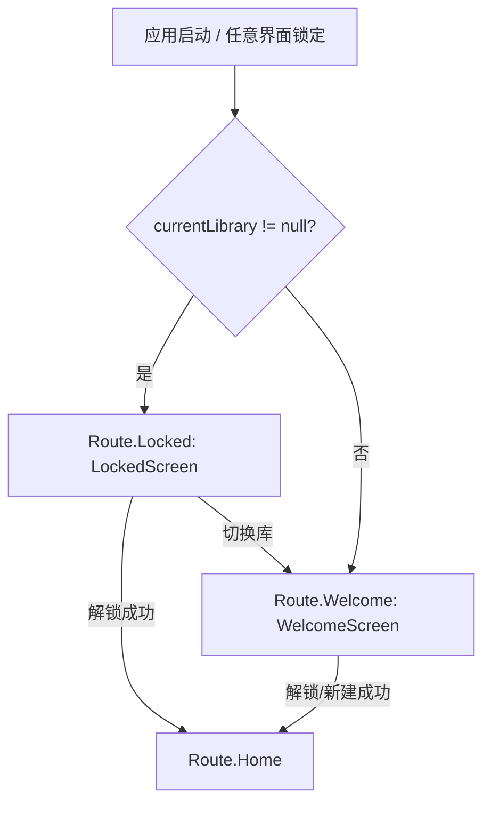

## 产品概述

新增一个专用的"已锁定"界面（LockedScreen），替代原本在锁定/后台超时后回退到的默认欢迎页（WelcomeScreen）。当应用存在已记录的库文件时，锁定后与首次启动的初始页面都显示该锁定页；当不存在任何库文件时仍回退到 WelcomeScreen 用于选择/新建库。

## 核心功能

- 专有 LockedScreen：中央显示应用图标（圆角矩形），下方显示"{库文件名（含后缀）}已锁定"文案。
- 解锁按钮：文本为"解锁"，仅在应用处于前台时显示；点击复用当前库的解锁流程（生物识别/主密码），成功则进入主界面。
- 切换库按钮：位于底部，仅在应用处于前台时显示；点击导航至 WelcomeScreen 以选择/新建其他库。
- 默认回退改造：所有因锁定（`isLibraryUnlocked==false` 或 `lib==null`）而回退到 WelcomeScreen 的界面，改为"存在当前库则回 LockedScreen，否则回 WelcomeScreen"。
- 初始页面：应用启动时若存在库文件，初始页面为 LockedScreen（解锁目标为上次库）；不存在库文件则为 WelcomeScreen。

## 技术栈

- 现有项目：Android（Kotlin）+ Jetpack Compose + Navigation3（`NavDisplay`）+ MIUIX 组件库（`top.yukonga.miuix.kmp.basic.*`）。
- 复用现有 `LibraryViewModel`、`TokenViewModel`、生物识别/自动解锁链路，不引入新架构。

## 实现方案

### 总体策略

新增 `Route.Locked` 路由与 `LockedScreen` 可组合项；在 `MainActivity` 中将"锁定回退"与"初始路由"逻辑统一为：存在 `currentLibrary` 时指向 `Route.Locked`，否则指向 `Route.Welcome`。LockedScreen 内部用本地 `LifecycleEventObserver` 监听 `ON_START/ON_STOP` 维护 `isForeground`，仅在前台显示"解锁"与"切换库"按钮（后台时隐藏按钮，避免最近任务列表预览中暴露可操作入口）。

### 关键技术决策

1. **复用而非重写解锁流程**：LockedScreen 不直接实现完整解锁 UI，而是复用 `TokenViewModel` 提供的解锁能力（`unlockCurrentLibrary` / 生物识别）。最小化改动、避免重复 KDF/凭据逻辑。

- 优先复用 `WelcomeScreen` 现有的内联解锁组件（`showInlineUnlock` + inline 输入 + 生物识别启动逻辑）。将解锁成功回调 `onEnterLibrary` 在本页映射为 `navigator.replaceAll(listOf(Route.Home)); showWelcome = false`。
- 若直接复制 WelcomeScreen 解锁逻辑成本过高，可在 LockedScreen 内实现简化版：调用 `tokenViewModel.unlockCurrentLibrary(plainPassword, keyFileData)`（主密码）或生物识别 `tokenViewModel.unlockWithBiometric`，成功后执行 `onEnterLibrary`。

2. **前台判定**：LockScreen 用 `androidx.lifecycle.compose.LocalLifecycleOwner` + `DisposableEffect` 监听 `ON_START`（`isForeground=true`）/`ON_STOP`（`isForeground=false`），与 `MainActivity` 中现有前后台判定保持一致（使用 ON_STOP/ON_START 而非 ON_PAUSE/ON_RESUME，避免半透明弹窗误判）。
3. **库文件名**：通过 `currentLibrary.value?.localPath` 用 `java.io.File(localPath).name` 取得含后缀的文件名（如 `WebDavPass.kdbx`），作为"已锁定"文案中的 `{库文件名称}`。
4. **应用图标**：使用 `painterResource(R.mipmap.ic_launcher)`（或确认后的 launcher 资源），以圆角矩形（MIUIX `Image` + `clip`/圆角 Modifier）居中展示。

### 性能与可靠性

- LockedScreen 仅依赖 `currentLibrary` 状态流与本地生命周期状态，重组范围小；不引入额外后台任务。
- 生物识别/解锁走既有 IO 协程，不阻塞 UI 线程。
- 保持 `FLAG_SECURE` 全局禁截屏不变，后台预览仍为系统空白。

## 实现注意事项

- 所有回退点（Home/SecurityCheck/Settings/GeneralSettings/SecuritySettings/BackupSettings/DatabaseSettings/TokenList/PasswordList/PasswordEntryDetail）的 `LaunchedEffect` 中，将 `navigator.replaceAll(listOf(Route.Welcome)); showWelcome = true` 改为条件回退：
`if (currentLibrary != null) navigator.replaceAll(listOf(Route.Locked)) else navigator.replaceAll(listOf(Route.Welcome))`；`showWelcome` 置为 `true`（保持与现有 Welcome 行为一致，Locked 由路由区分，不依赖 showWelcome）。
- 初始路由：`startRoute` 改为依据 `currentLibrary`（启动时已预热）决定：`if (currentLibrary != null) Route.Locked else Route.Welcome`。因 `showWelcome` 现仅用于扫描底部弹窗显隐，保留其初始 `true` 不影响 Locked 显示。
- 避免破坏 `WelcomeScreen` 现有功能（选择/新建/导入库），仅新增 LockedScreen 与路由分支。

## 架构设计



LockScreen 与 WelcomeScreen 平级，均为 NavDisplay 的 entry，共享 `TokenViewModel`、`LibraryViewModel`。

## 目录结构

```
Android/app/src/main/java/xzynine/WebDAVPass/Android/
├── ui/navigation/Routes.kt                     # [MODIFY] 新增 data object Locked : Route
├── ui/Screen/LockedScreen.kt                   # [NEW] 锁定页：应用图标 + "库名已锁定" + 解锁/切换库按钮（仅前台）
└── ui/MainActivity.kt                          # [MODIFY] 初始路由改为 currentLibrary 判断；所有锁定回退点改为 Route.Locked/Welcome 分支；注册 Route.Locked entry
```

## 设计风格

采用与现有 WebDAVPass 一致的安全、简洁风格（MIUIX 组件语言）。锁定页为单屏居中布局，背景沿用应用主题背景。

## 页面区块（自上而下）

1. 顶部留白区：无操作栏，保持纯净。
2. 中央应用图标区：圆角矩形（约 96dp）居中展示应用图标（launcher mipmap），带轻微阴影。
3. 状态文案区：图标下方显示"{库文件名}已锁定"（如"WebDavPass.kdbx 已锁定"），字号 18sp，次级文字色。
4. 操作按钮区（仅前台显示）：主按钮"解锁"（MIUIX Button，圆角、主色填充）；当 `isForeground == false` 时整组按钮隐藏（仅保留图标与文案，避免后台预览暴露操作入口）。
5. 底部切换库按钮（仅前台显示）：次级样式按钮"切换库"，点击 `navigator.replaceAll(listOf(Route.Welcome))`。

## 交互

- 进入页面：图标淡入；前台判定由生命周期驱动，按钮显隐无动画跳变（建议 150ms alpha 过渡）。
- 解锁点击：复用生物识别/主密码流程，解锁中按钮显示"解锁中…"并禁用。
- 仅前台显示按钮：退到后台（`ON_STOP`）按钮立即隐藏；回前台（`ON_START`）恢复。